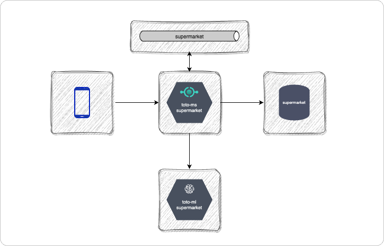

# Supermarket API

API to manage supermarket lists and their items.  
This API also supports Toto Games aimed at gathering information for the training of models. 

## Index

1. [General Architecture and Processes](./docs/general.md)

## Architectural Diagram
The following diagram represents the current architecture of `toto-ms-supermarket`. 
   

