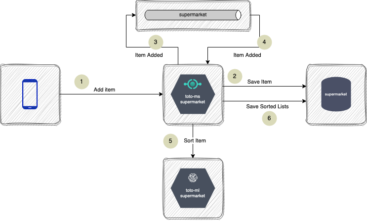

# Adding an Item

Adding an item to the supermarket list triggers two processes: 
1. Saving the item on DB
2. Sorting the item on each *Location List (LL)*

The following diagram depicts the flow:   

The steps are the following: 

1. The App adds an item

2. The `toto-ms-supermarket` API saves the Item on Mongo

3. The `toto-ms-supermarket` posts an event on the `supermarket`topic and returns a `201` to the App.

4. The `toto-ms-supermarket` receives the `item-added` event and now needs to add that item to the different sorted lists.  
Remember that there is **one sorted Location List per Location**. 

5. To add the item, `toto-ms-supermarket` does the following, **for each $LL_i$**:
    * Calls the `toto-ml-supermarket` model providing both the currently stored $LL_i$ and the new item $I$.
    * The `toto-ml-supermarket` model will return the list $LL^{'}_i$ which is the new sorted list derived from adding item $I$ to the list $LL_i$ and sorting the list.

6. `toto-ms-supermarket` saves all the new *LLs*.